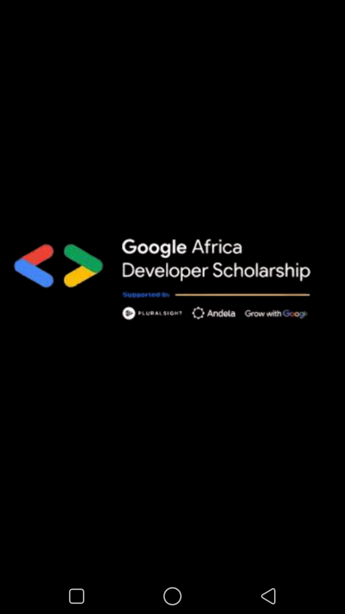
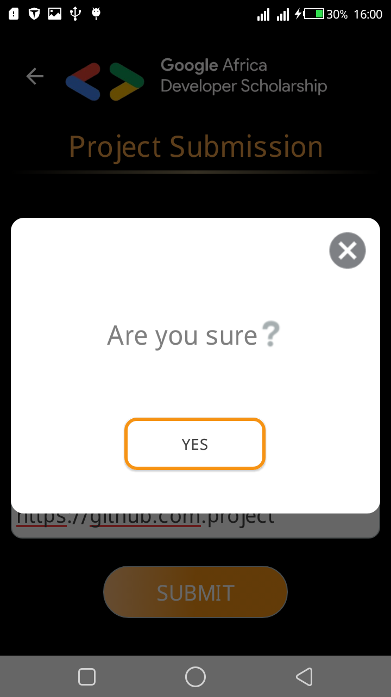
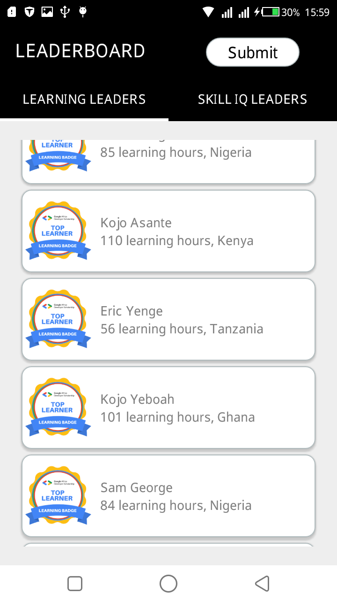
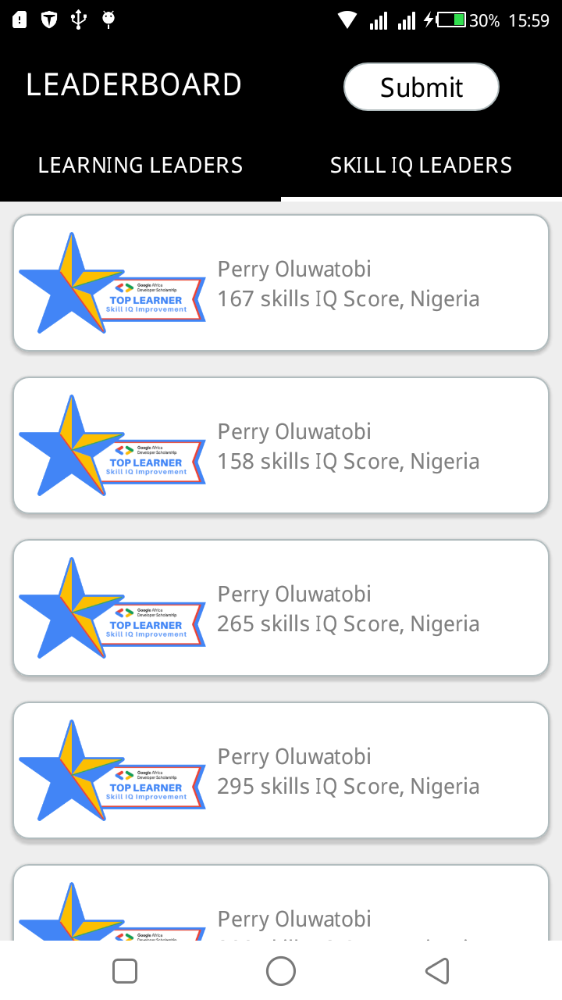
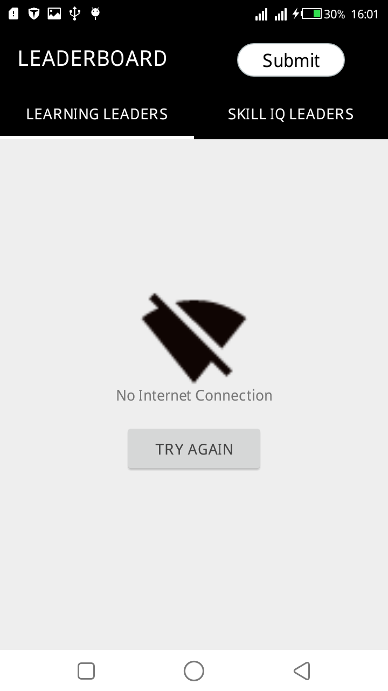
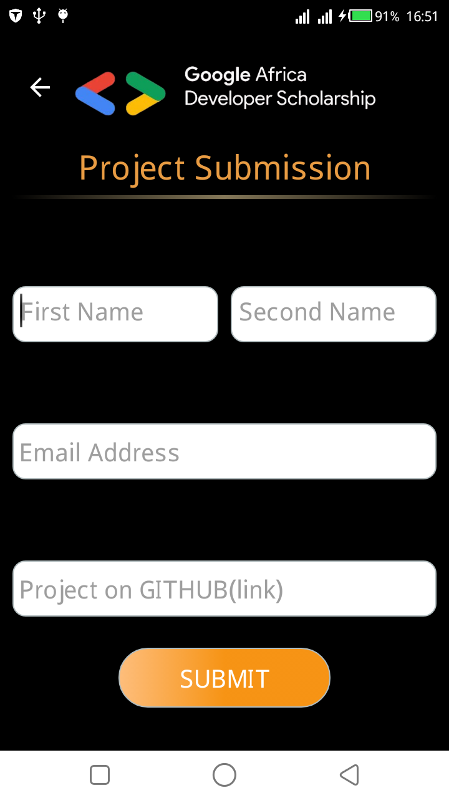
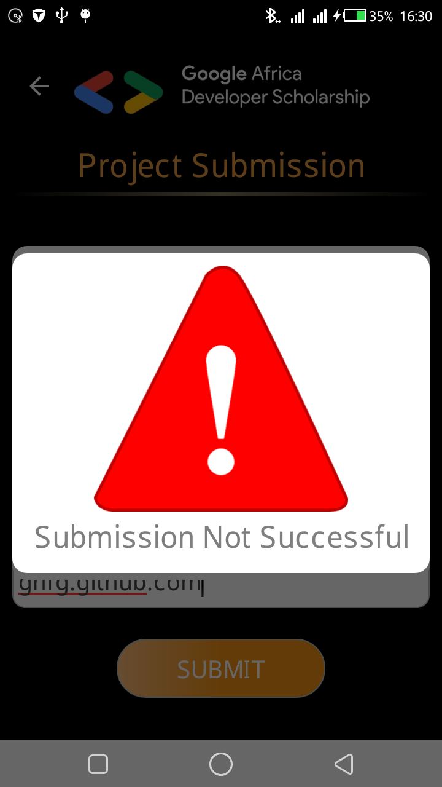
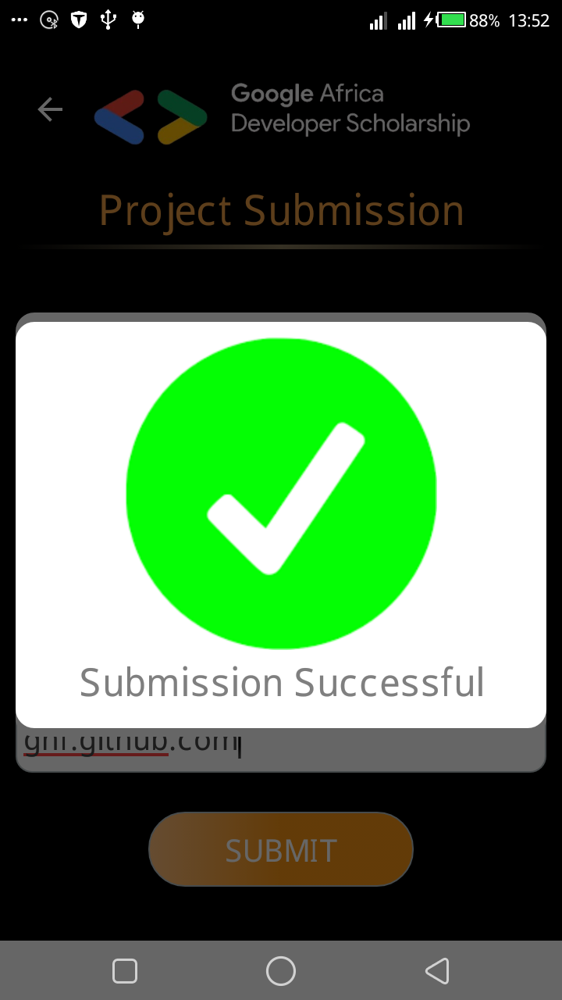

# GADS-TopScorers
# Author - Michael Ochieng' Odera
Date - 6th September 2020

# Description
This application is about the presentation of the top scorers for the google africa developers scholarship project. This is the practise phase of the project.
The leaders are shown by hours and by skills test.

GADS application is an android application, mobile-ready, and depends on online connection to fetch data from the api resource.

  - Java11
  - Android 

# Additional Feature!

  - Implements a network listener to check for internet connectivity.

You can also:
  - Submit the application through the application itself.
  

### Tech
 The application uses the following technologies to work properly:

* [Java-11] - Codes for the back end
* [XML] - This is used to display views
* [Retrofit] - This is the library required to fetch the data from the API resource.
* [Butterknife] - This is used for a clean binding of views to their respective data

### Installation

GADS application requires a device that has Android operating system to run. The emulator containing an Android operating System.

For production environments...
 *You can generate an apk bundle which is signed by ensuring that a release version is generated*

### Gradle Dependencies

GADS app uses the following dependencies.

| Plugin | Gradle Implementations |
| ------ | ------ |
| Butterknife | 'com.jakewharton:butterknife:10.2.3'|
| Material Design |'com.google.android.material:material:1.2.1'|
| Retrofit | 'com.squareup.retrofit2:retrofit:2.7.2'|
| Gson-Converter | 'com.squareup.retrofit2:converter-gson:2.7.2' |
| Picasso | 'com.squareup.picasso:picasso:2.71828' |

### Development
To run the application on android studio, you have to run it using the *Run App* button or the *Debug app* button.
APKs for trial can be generated through the build apk option under the Build tab on the android studio options window.

### Tests
Tests for the application can be written through Espresso and AndroidJUnit for instrumentation tests.

#### Screenshots

##### Launcher Photo

##### Confirmation Photo

##### Hours Leaders Display

##### Skills Leaders Display

##### No Network Display

##### Form Display

##### Failure Dialog

##### Success Dialog

License
----

[MIT](LICENSE)